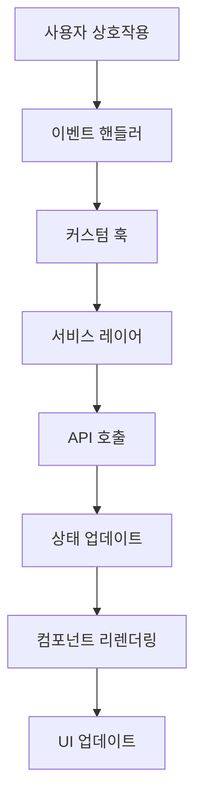
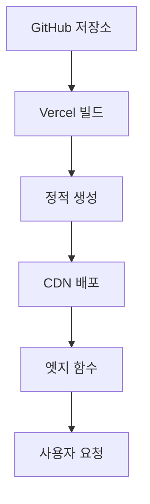
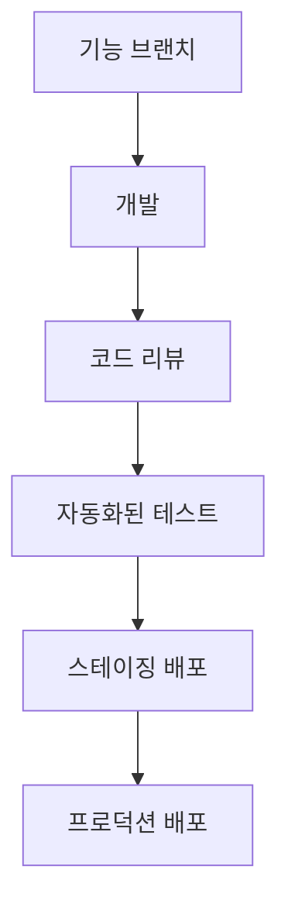

# 아키텍처 개요 🏗️

이 문서는 Seoul Fit Frontend의 포괄적인 아키텍처 개요를 제공하며, 시스템 설계, 컴포넌트 구조, 데이터 플로우, 기술적 결정사항을 포함합니다.

## 📋 목차

- [시스템 개요](#시스템-개요)
- [프로젝트 구조](#프로젝트-구조)
- [아키텍처 레이어](#아키텍처-레이어)
- [컴포넌트 아키텍처](#컴포넌트-아키텍처)
- [데이터 플로우](#데이터-플로우)
- [상태 관리](#상태-관리)
- [API 통합](#api-통합)
- [성능 전략](#성능-전략)
- [보안 고려사항](#보안-고려사항)
- [배포 아키텍처](#배포-아키텍처)

---

## 🎯 시스템 개요

Seoul Fit Frontend는 서울의 공공시설을 발견하고 탐색할 수 있는 인터랙티브 플랫폼을 제공하는 **Next.js 15 기반의 현대적인 React 웹 애플리케이션**입니다. 이 애플리케이션은 명확한 관심사 분리를 통한 **레이어드 아키텍처** 패턴을 따릅니다.

### 핵심 아키텍처 원칙

- **컴포넌트 기반 아키텍처** - 모듈화되고 재사용 가능한 UI 컴포넌트
- **훅 기반 로직** - 비즈니스 로직 분리를 위한 커스텀 훅
- **API 우선 설계** - 다중 데이터 소스와의 깔끔한 통합
- **성능 최적화** - 지연 로딩, 캐싱, 최적화 전략
- **접근성 우선** - 전반적인 WCAG 2.1 AA 준수
- **타입 안전성** - 포괄적인 TypeScript 커버리지

---

## 📁 프로젝트 구조

```
seoul-fit-fe/
├── 📱 app/                     # Next.js 15 App Router
│   ├── api/                   # 서버사이드 API 라우트
│   ├── auth/                  # 인증 페이지
│   ├── globals.css            # 전역 스타일 및 CSS 변수
│   ├── layout.tsx            # 루트 레이아웃 컴포넌트
│   └── page.tsx              # 홈 페이지 컴포넌트
│
├── 🧩 components/             # React 컴포넌트
│   ├── auth/                 # 인증 컴포넌트
│   ├── layout/               # 레이아웃 및 네비게이션 컴포넌트
│   ├── map/                  # 지도 관련 컴포넌트
│   └── ui/                   # 재사용 가능한 UI 기본 요소 (Radix UI 기반)
│
├── 🔗 hooks/                  # 커스텀 React 훅
│   ├── useAuth.ts            # 인증 로직
│   ├── useKakaoMap.ts        # 지도 인스턴스 관리
│   ├── useFacilities.ts      # 시설 데이터 관리
│   └── ...                   # 기능별 훅들
│
├── 📚 lib/                    # 유틸리티 라이브러리
│   ├── types.ts              # TypeScript 타입 정의
│   ├── utils.ts              # 일반 유틸리티 함수
│   ├── kakao-map.ts          # 카카오맵 통합
│   └── seoulApi.ts           # 서울 API 클라이언트
│
├── 🔌 services/               # API 서비스
│   ├── auth.ts               # 인증 서비스
│   ├── facilities.ts         # 시설 데이터 서비스
│   ├── weather.ts            # 날씨 서비스
│   └── ...                   # 도메인별 서비스들
│
├── 🗄️ store/                  # 상태 관리
│   ├── authStore.ts          # 인증 상태 (Zustand)
│   └── notificationStore.ts  # 알림 상태 (Zustand)
│
└── 🎨 styles/                 # 스타일링 자산
    └── marker-animations.css # 지도 마커 애니메이션
```

---

## 🏛️ 아키텍처 레이어

### 1. **프레젠테이션 레이어** (`components/`)
- **UI 컴포넌트** - Radix UI를 사용한 재사용 가능하고 스타일링된 컴포넌트
- **레이아웃 컴포넌트** - 애플리케이션 셸 및 네비게이션
- **기능 컴포넌트** - 도메인별 UI 컴포넌트

### 2. **비즈니스 로직 레이어** (`hooks/`)
- **커스텀 훅** - 비즈니스 로직과 상태 관리 캡슐화
- **데이터 페칭** - API 통합 및 캐싱 로직
- **이벤트 처리** - 사용자 상호작용 및 애플리케이션 이벤트

### 3. **서비스 레이어** (`services/`)
- **API 클라이언트** - 외부 서비스 통합
- **데이터 변환** - API 응답을 애플리케이션 모델로 변환
- **에러 처리** - 중앙화된 에러 관리

### 4. **데이터 레이어** (`store/`, `lib/`)
- **상태 관리** - Zustand를 사용한 애플리케이션 전역 상태
- **타입 정의** - 포괄적인 TypeScript 인터페이스
- **유틸리티 함수** - 공유 헬퍼 함수

### 5. **인프라 레이어** (`app/api/`)
- **API 라우트** - 데이터 집계를 위한 서버사이드 엔드포인트
- **미들웨어** - 요청/응답 처리
- **외부 통합** - 서드파티 서비스 연결

---

## 🧩 컴포넌트 아키텍처

### 컴포넌트 계층 구조

```
EnhancedKakaoMap (루트)
├── Header
│   ├── SearchInput
│   ├── UserMenu
│   └── NotificationBell
├── SideBar
│   ├── FacilityFilter
│   ├── UserPreferences
│   └── AuthSection
└── MapContainer
    ├── MapView
    │   ├── KakaoMap
    │   ├── FacilityMarkers
    │   └── UserLocationMarker
    ├── MapControls
    │   ├── CongestionPanel
    │   ├── WeatherPanel
    │   └── LocationButton
    ├── FacilityBottomSheet
    └── ClusterBottomSheet
```

### 컴포넌트 디자인 패턴

#### **복합 컴포넌트 (Compound Components)**
```typescript
// MapContainer가 복합 컴포넌트 역할
<MapContainer>
  <MapView />
  <MapControls />
  <FacilityBottomSheet />
</MapContainer>
```

#### **렌더 프롭 패턴 (Render Props Pattern)**
```typescript
<FacilityList
  render={({ facilities, loading }) => (
    <VirtualizedList items={facilities} loading={loading} />
  )}
/>
```

#### **훅 기반 로직 분리**
```typescript
function MapContainer() {
  // 모든 비즈니스 로직을 커스텀 훅에서 처리
  const { mapInstance, mapStatus } = useKakaoMap();
  const { facilities, isLoading } = useFacilities();
  const { currentLocation } = useLocation();
  
  // 컴포넌트는 렌더링만 담당
  return <MapView {...props} />;
}
```

---

## 🔄 데이터 플로우

### 단방향 데이터 플로우



### 실시간 데이터 플로우

1. **사용자 위치 변경**이 데이터 페칭을 트리거
2. **다중 API**를 효율성을 위해 병렬로 호출
3. **상태 업데이트**가 React 컨텍스트와 Zustand 스토어를 통해 전파
4. **컴포넌트 리렌더링**이 새로운 데이터로 수행
5. **UI 업데이트**가 최신 정보를 반영

### 예시 데이터 플로우: 시설 검색

```typescript
// 1. 사용자가 검색 입력에 타이핑
const handleSearchChange = (query: string) => {
  
  // 2. 훅이 검색을 처리
  const { searchResults } = useSearchCache(query);
  
  // 3. 서비스 레��어가 API 호출
  const results = await searchService.searchFacilities(query);
  
  // 4. 상태 업데이트가 리렌더링 트리거
  setSearchResults(results);
  
  // 5. UI가 업데이트된 결과 표시
};
```

---

## 🗄️ 상태 관리

### 상태 아키텍처

```typescript
// 전역 상태 (Zustand)
interface AppState {
  auth: AuthState;
  notifications: NotificationState;
  preferences: UserPreferences;
}

// 로컬 상태 (React Hooks)
interface ComponentState {
  ui: UIState;           // 로딩, 에러, 모달 상태
  form: FormState;       // 폼 입력 및 검증
  cache: CacheState;     // 임시 데이터 및 API 캐시
}
```

### 상태 관리 전략

#### **전역 상태** (Zustand)
- **인증** - 사용자 로그인 상태, 토큰
- **사용자 선호도** - 시설 필터, 설정
- **알림** - 앱 전역 알림 및 경고

#### **서버 상태** (커스텀 훅)
- **API 데이터** - 시설 데이터, 날씨, 혼잡도
- **캐시 관리** - 요청 중복 제거 및 캐싱
- **실시간 업데이트** - 라이브 데이터 동기화

#### **로컬 상태** (useState/useReducer)
- **UI 상태** - 모달 가시성, 로딩 상태
- **폼 상태** - 입력값, 검증 에러
- **임시 데이터** - 컴포넌트별 데이터

### 상태 관리 예시

```typescript
// 전역 상태 (Zustand)
const useAuthStore = create<AuthState>((set) => ({
  user: null,
  login: (user) => set({ user }),
  logout: () => set({ user: null }),
}));

// 서버 상태 (커스텀 훅)
const useFacilities = (location: Location) => {
  const [facilities, setFacilities] = useState<Facility[]>([]);
  const [loading, setLoading] = useState(true);
  
  useEffect(() => {
    fetchFacilities(location).then(setFacilities);
  }, [location]);
  
  return { facilities, loading };
};

// 로컬 상태 (React useState)
const [selectedFacility, setSelectedFacility] = useState<Facility | null>(null);
```

---

## 🔌 API 통합

### API 아키텍처

```typescript
// 서비스 레이어 구조
interface ServiceLayer {
  auth: AuthService;
  facilities: FacilityService;
  weather: WeatherService;
  maps: MapService;
}

// 서비스 구현 예시
class FacilityService {
  async getFacilities(location: Location): Promise<Facility[]> {
    const response = await apiClient.get('/facilities', { params: location });
    return response.data.map(transformFacilityData);
  }
}
```

### 외부 API

#### **카카오맵 API**
- **목적**: 인터랙티브 지도, 지오코딩, 장소 검색
- **통합**: 직접 JavaScript SDK 통합
- **캐싱**: 브라우저에 의한 지도 타일 캐싱

#### **서울 열린데이터 광장**
- **목적**: 공공시설 정보
- **통합**: Next.js API 라우트를 통한 RESTful API 호출
- **캐싱**: 재검증이 포함된 서버사이드 캐싱

#### **날씨 API**
- **목적**: 실시간 날씨 조건
- **통합**: 폴백이 포함된 스케줄된 API 호출
- **캐싱**: 백그라운드 새로고침이 포함된 30분 캐시

### API 에러 처리

```typescript
// 중앙화된 에러 처리
const apiClient = axios.create({
  baseURL: process.env.NEXT_PUBLIC_API_BASE_URL,
  timeout: 10000,
});

apiClient.interceptors.response.use(
  (response) => response,
  (error) => {
    // 에러 로깅
    console.error('API 에러:', error);
    
    // UI용 에러 변환
    throw new APIError(error.message, error.status);
  }
);
```

---

## ⚡ 성능 전략

### 최적화 기법

#### **코드 분할**
```typescript
// 라우트 기반 분할
const MapContainer = lazy(() => import('./MapContainer'));
const FacilityList = lazy(() => import('./FacilityList'));

// 컴포넌트 기반 분할
const HeavyComponent = dynamic(() => import('./HeavyComponent'), {
  loading: () => <Skeleton />,
  ssr: false
});
```

#### **데이터 페칭 최적화**
- **병렬 요청** - 다중 API 동시 호출
- **요청 중복 제거** - 중복 API 호출 방지
- **백그라운드 새로고침** - 오래된 데이터를 제공하면서 캐시 업데이트
- **무한 스크롤** - 필요에 따른 데이터 로드

#### **렌더링 최적화**
- **React.memo** - 불필요한 리렌더링 방지
- **useCallback/useMemo** - 비용이 많이 드는 계산 최적화
- **가상 스크롤링** - 대용량 시설 목록 처리
- **이미지 최적화** - 최적화가 포함된 Next.js Image 컴포넌트

#### **번들 최적화**
- **트리 셰이킹** - 사용하지 않는 코드 제거
- **동적 임포트** - 필요에 따른 기능 로드
- **벤더 청킹** - 벤더와 앱 코드 분리
- **압축** - Gzip/Brotli 압축

### 성능 지표

- **First Contentful Paint (FCP)** < 1.5초
- **Largest Contentful Paint (LCP)** < 2.5초
- **First Input Delay (FID)** < 100ms
- **Cumulative Layout Shift (CLS)** < 0.1

---

## 🔒 보안 고려사항

### 보안 조치

#### **API 보안**
- **API 키 관리** - 환경 변수, 클라이언트 코드에 절대 포함 안 함
- **요청 검증** - 입력 살균 및 검증
- **속도 제한** - API 남용 방지
- **CORS 설정** - 허용된 출처로 제한

#### **인증 보안**
- **OAuth 2.0** - 안전한 카카오 로그인 통합
- **토큰 관리** - 안전한 저장 및 새로고침 패턴
- **세션 보안** - HttpOnly 쿠키, 보안 플래그
- **CSRF 보호** - Anti-CSRF 토큰

#### **클라이언트사이드 보안**
- **XSS 방지** - React의 내장 보호 + CSP 헤더
- **데이터 검증** - 클라이언트 및 서버사이드 검증
- **보안 헤더** - Next.js 설정을 통한 보안 헤더
- **의존성 스캔** - 정기적인 보안 감사

### 보안 헤더

```typescript
// next.config.ts
const securityHeaders = [
  {
    key: 'X-DNS-Prefetch-Control',
    value: 'on'
  },
  {
    key: 'Strict-Transport-Security',
    value: 'max-age=63072000; includeSubDomains; preload'
  },
  {
    key: 'X-Frame-Options',
    value: 'DENY'
  },
  {
    key: 'X-Content-Type-Options',
    value: 'nosniff'
  },
  {
    key: 'Referrer-Policy',
    value: 'origin-when-cross-origin'
  }
];
```

---

## 🚀 배포 아키텍처

### 배포 전략



### 환경 설정

#### **개발 환경**
- **로컬 개발** - 핫 리로드가 포함된 `npm run dev`
- **API 모킹** - 오프라인 개발을 위한 모의 API
- **디버그 도구** - React DevTools, 성능 프로파일링

#### **스테이징 환경**
- **프리뷰 배포** - 자동 Vercel 프리뷰 빌드
- **통합 테스트** - 전체 API 통합 테스트
- **성능 테스트** - Lighthouse CI 통합

#### **프로덕션 환경**
- **정적 생성** - 최적 성능을 위한 사전 빌드 페이지
- **엣지 최적화** - 글로벌 CDN 배포
- **모니터링** - 실시간 성능 및 에러 모니터링

### 인프라

- **호스팅**: Vercel (Next.js 최적화)
- **CDN**: Vercel Edge Network
- **분석**: Vercel Analytics + Google Analytics
- **모니터링**: 에러 추적을 위한 Sentry
- **성능**: Vercel Speed Insights

---

## 🔄 개발 워크플로우

### Git 워크플로우



### 품질 게이트

1. **코드 품질** - ESLint, Prettier, TypeScript
2. **테스트** - 단위 테스트, 통합 테스트
3. **성능** - 번들 분석, Lighthouse
4. **보안** - 의존성 감사, 보안 스캔
5. **접근성** - axe-core 테스트, 수동 검토

---

## 📊 모니터링 및 분석

### 성능 모니터링

- **Core Web Vitals** - LCP, FID, CLS 추적
- **커스텀 지표** - API 응답 시간, 사용자 상호작용
- **에러 추적** - JavaScript 에러, API 실패
- **사용자 분석** - 사용 패턴, 기능 채택

### 로깅 전략

```typescript
// 구조화된 로깅
const logger = {
  info: (message: string, context?: object) => {
    console.log(JSON.stringify({ 
      level: 'info', 
      message, 
      context, 
      timestamp: new Date().toISOString() 
    }));
  },
  error: (message: string, error?: Error, context?: object) => {
    console.error(JSON.stringify({ 
      level: 'error', 
      message, 
      error: error?.stack, 
      context, 
      timestamp: new Date().toISOString() 
    }));
  }
};
```

---

## 🚧 향후 아키텍처 고려사항

### 확장성 계획

- **마이크로 프론트엔드 아키텍처** - 도메인별 애플리케이션으로 분할
- **GraphQL 통합** - 복잡한 쿼리를 위한 통합 데이터 레이어
- **서비스 워커** - 오프라인 기능 및 백그라운드 동기화
- **WebAssembly** - 성능이 중요한 계산

### 기술 부채 관리

- **리팩토링 로드맵** - 레거시 코드의 체계적 개선
- **의존성 업데이트** - 호환성 테스트가 포함된 정기 업데이트
- **아키텍처 검토** - 분기별 아키텍처 평가
- **성능 예산** - 자동화된 성능 회귀 방지

---

## 📚 추가 리소스

- **[API 문서](docs/api/)** - 상세한 API 참조
- **[컴포넌트 스토리북](https://storybook.seoul-fit.com)** - UI 컴포넌트 라이브러리
- **[성능 지표](https://performance.seoul-fit.com)** - 실시간 성능 대시보드
- **[아키텍처 결정 기록](docs/architecture/adr/)** - 아키텍처 결정 히스토리

---

이 아키텍처는 서울의 공공시설을 발견하는 뛰어난 사용자 경험을 제공하면서 **확장 가능하고**, **유지보수 가능하며**, **성능이 우수하도록** 설계되었습니다. 모듈러 설계는 애플리케이션이 발전함에 따라 쉬운 기능 추가와 수정을 가능하게 합니다.

아키텍처에 대한 질문이나 개선 제안이 있으시면 [기여 가이드](CONTRIBUTING.md)를 참조해 주세요.
