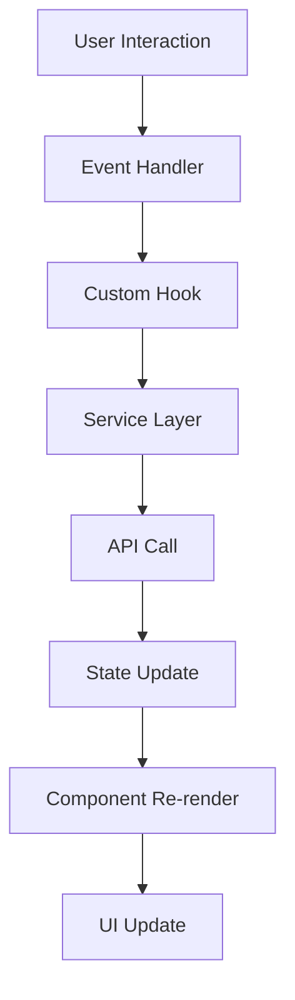
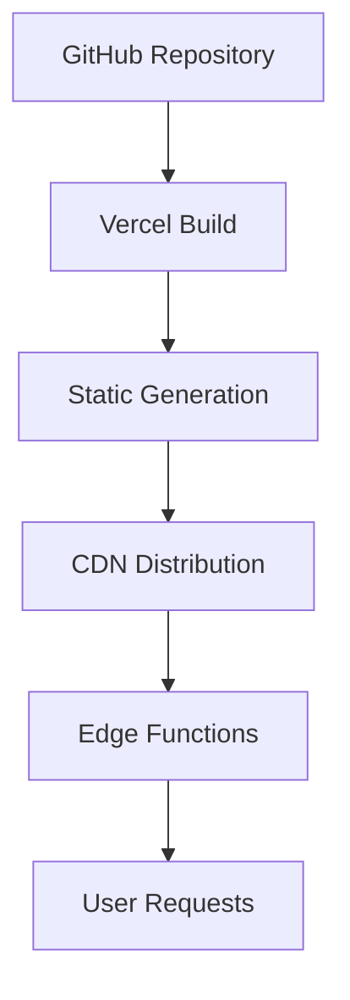
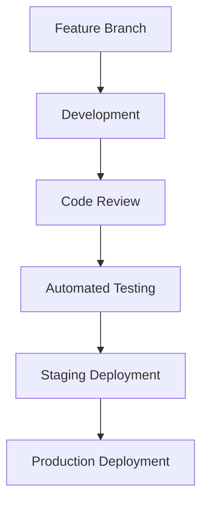

# Architecture Overview 🏗️

This document provides a comprehensive overview of the Seoul Fit Frontend architecture, including system design, component structure, data flow, and technical decisions.

## 📋 Table of Contents

- [System Overview](#system-overview)
- [Project Structure](#project-structure)
- [Architecture Layers](#architecture-layers)
- [Component Architecture](#component-architecture)
- [Data Flow](#data-flow)
- [State Management](#state-management)
- [API Integration](#api-integration)
- [Performance Strategy](#performance-strategy)
- [Security Considerations](#security-considerations)
- [Deployment Architecture](#deployment-architecture)

---

## 🎯 System Overview

Seoul Fit Frontend is a **modern React-based web application** built with Next.js 15 that provides an interactive platform for discovering and navigating Seoul's public facilities. The application follows a **layered architecture** pattern with clear separation of concerns.

### Key Architectural Principles

- **Component-Based Architecture** - Modular, reusable UI components
- **Hook-Based Logic** - Custom hooks for business logic separation
- **API-First Design** - Clean integration with multiple data sources
- **Performance-Optimized** - Lazy loading, caching, and optimization strategies
- **Accessibility-First** - WCAG 2.1 AA compliance throughout
- **Type-Safe** - Comprehensive TypeScript coverage

---

## 📁 Project Structure

```
seoul-fit-fe/
├── 📱 app/                     # Next.js 15 App Router
│   ├── api/                   # Server-side API routes
│   ├── auth/                  # Authentication pages
│   ├── globals.css            # Global styles and CSS variables
│   ├── layout.tsx            # Root layout component
│   └── page.tsx              # Home page component
│
├── 🧩 components/             # React Components
│   ├── auth/                 # Authentication components
│   ├── layout/               # Layout and navigation components
│   ├── map/                  # Map-related components
│   └── ui/                   # Reusable UI primitives (Radix UI based)
│
├── 🔗 hooks/                  # Custom React Hooks
│   ├── useAuth.ts            # Authentication logic
│   ├── useKakaoMap.ts        # Map instance management
│   ├── useFacilities.ts      # Facility data management
│   └── ...                   # Feature-specific hooks
│
├── 📚 lib/                    # Utility Libraries
│   ├── types.ts              # TypeScript type definitions
│   ├── utils.ts              # General utility functions
│   ├── kakao-map.ts          # Kakao Map integration
│   └── seoulApi.ts           # Seoul API client
│
├── 🔌 services/               # API Services
│   ├── auth.ts               # Authentication service
│   ├── facilities.ts         # Facility data service
│   ├── weather.ts            # Weather service
│   └── ...                   # Domain-specific services
│
├── 🗄️ store/                  # State Management
│   ├── authStore.ts          # Authentication state (Zustand)
│   └── notificationStore.ts  # Notification state (Zustand)
│
└── 🎨 styles/                 # Styling Assets
    └── marker-animations.css # Map marker animations
```

---

## 🏛️ Architecture Layers

### 1. **Presentation Layer** (`components/`)
- **UI Components** - Reusable, styled components using Radix UI
- **Layout Components** - Application shell and navigation
- **Feature Components** - Domain-specific UI components

### 2. **Business Logic Layer** (`hooks/`)
- **Custom Hooks** - Encapsulate business logic and state management
- **Data Fetching** - API integration and caching logic
- **Event Handling** - User interaction and application events

### 3. **Service Layer** (`services/`)
- **API Clients** - External service integration
- **Data Transformation** - Convert API responses to application models
- **Error Handling** - Centralized error management

### 4. **Data Layer** (`store/`, `lib/`)
- **State Management** - Application-wide state using Zustand
- **Type Definitions** - Comprehensive TypeScript interfaces
- **Utility Functions** - Shared helper functions

### 5. **Infrastructure Layer** (`app/api/`)
- **API Routes** - Server-side endpoints for data aggregation
- **Middleware** - Request/response processing
- **External Integrations** - Third-party service connections

---

## 🧩 Component Architecture

### Component Hierarchy

```
EnhancedKakaoMap (Root)
├── Header
│   ├── SearchInput
│   ├── UserMenu
│   └── NotificationBell
├── SideBar
│   ├── FacilityFilter
│   ├── UserPreferences
│   └── AuthSection
└── MapContainer
    ├── MapView
    │   ├── KakaoMap
    │   ├── FacilityMarkers
    │   └── UserLocationMarker
    ├── MapControls
    │   ├── CongestionPanel
    │   ├── WeatherPanel
    │   └── LocationButton
    ├── FacilityBottomSheet
    └── ClusterBottomSheet
```

### Component Design Patterns

#### **Compound Components**
```typescript
// MapContainer acts as a compound component
<MapContainer>
  <MapView />
  <MapControls />
  <FacilityBottomSheet />
</MapContainer>
```

#### **Render Props Pattern**
```typescript
<FacilityList
  render={({ facilities, loading }) => (
    <VirtualizedList items={facilities} loading={loading} />
  )}
/>
```

#### **Hook-Based Logic Separation**
```typescript
function MapContainer() {
  // All business logic in custom hooks
  const { mapInstance, mapStatus } = useKakaoMap();
  const { facilities, isLoading } = useFacilities();
  const { currentLocation } = useLocation();
  
  // Component only handles rendering
  return <MapView {...props} />;
}
```

---

## 🔄 Data Flow

### Unidirectional Data Flow



### Real-Time Data Flow

1. **User Location Change** triggers data fetching
2. **Multiple APIs** called in parallel for efficiency
3. **State Updates** propagate through React context and Zustand stores
4. **Components Re-render** with new data
5. **UI Updates** reflect the latest information

### Example Data Flow: Facility Search

```typescript
// 1. User types in search input
const handleSearchChange = (query: string) => {
  
  // 2. Hook processes the search
  const { searchResults } = useSearchCache(query);
  
  // 3. Service layer makes API calls
  const results = await searchService.searchFacilities(query);
  
  // 4. State updates trigger re-renders
  setSearchResults(results);
  
  // 5. UI displays updated results
};
```

---

## 🗄️ State Management

### State Architecture

```typescript
// Global State (Zustand)
interface AppState {
  auth: AuthState;
  notifications: NotificationState;
  preferences: UserPreferences;
}

// Local State (React Hooks)
interface ComponentState {
  ui: UIState;           // Loading, errors, modal states
  form: FormState;       // Form inputs and validation
  cache: CacheState;     // Temporary data and API cache
}
```

### State Management Strategy

#### **Global State** (Zustand)
- **Authentication** - User login state, tokens
- **User Preferences** - Facility filters, settings
- **Notifications** - App-wide notifications and alerts

#### **Server State** (Custom Hooks)
- **API Data** - Facility data, weather, congestion
- **Cache Management** - Request deduplication and caching
- **Real-time Updates** - Live data synchronization

#### **Local State** (useState/useReducer)
- **UI State** - Modal visibility, loading states
- **Form State** - Input values, validation errors
- **Temporary Data** - Component-specific data

### Example State Management

```typescript
// Global state (Zustand)
const useAuthStore = create<AuthState>((set) => ({
  user: null,
  login: (user) => set({ user }),
  logout: () => set({ user: null }),
}));

// Server state (Custom hook)
const useFacilities = (location: Location) => {
  const [facilities, setFacilities] = useState<Facility[]>([]);
  const [loading, setLoading] = useState(true);
  
  useEffect(() => {
    fetchFacilities(location).then(setFacilities);
  }, [location]);
  
  return { facilities, loading };
};

// Local state (React useState)
const [selectedFacility, setSelectedFacility] = useState<Facility | null>(null);
```

---

## 🔌 API Integration

### API Architecture

```typescript
// Service Layer Structure
interface ServiceLayer {
  auth: AuthService;
  facilities: FacilityService;
  weather: WeatherService;
  maps: MapService;
}

// Example Service Implementation
class FacilityService {
  async getFacilities(location: Location): Promise<Facility[]> {
    const response = await apiClient.get('/facilities', { params: location });
    return response.data.map(transformFacilityData);
  }
}
```

### External APIs

#### **Kakao Map API**
- **Purpose**: Interactive maps, geocoding, place search
- **Integration**: Direct JavaScript SDK integration
- **Caching**: Map tiles cached by browser

#### **Seoul Open Data Portal**
- **Purpose**: Public facility information
- **Integration**: RESTful API calls through Next.js API routes
- **Caching**: Server-side caching with revalidation

#### **Weather API**
- **Purpose**: Real-time weather conditions
- **Integration**: Scheduled API calls with fallback
- **Caching**: 30-minute cache with background refresh

### API Error Handling

```typescript
// Centralized error handling
const apiClient = axios.create({
  baseURL: process.env.NEXT_PUBLIC_API_BASE_URL,
  timeout: 10000,
});

apiClient.interceptors.response.use(
  (response) => response,
  (error) => {
    // Log error
    console.error('API Error:', error);
    
    // Transform error for UI
    throw new APIError(error.message, error.status);
  }
);
```

---

## ⚡ Performance Strategy

### Optimization Techniques

#### **Code Splitting**
```typescript
// Route-based splitting
const MapContainer = lazy(() => import('./MapContainer'));
const FacilityList = lazy(() => import('./FacilityList'));

// Component-based splitting
const HeavyComponent = dynamic(() => import('./HeavyComponent'), {
  loading: () => <Skeleton />,
  ssr: false
});
```

#### **Data Fetching Optimization**
- **Parallel Requests** - Multiple APIs called simultaneously
- **Request Deduplication** - Prevent duplicate API calls
- **Background Refresh** - Update cache while serving stale data
- **Infinite Scrolling** - Load data on demand

#### **Rendering Optimization**
- **React.memo** - Prevent unnecessary re-renders
- **useCallback/useMemo** - Optimize expensive computations
- **Virtual Scrolling** - Handle large facility lists
- **Image Optimization** - Next.js Image component with optimization

#### **Bundle Optimization**
- **Tree Shaking** - Remove unused code
- **Dynamic Imports** - Load features on demand
- **Vendor Chunking** - Separate vendor and app code
- **Compression** - Gzip/Brotli compression

### Performance Metrics

- **First Contentful Paint (FCP)** < 1.5s
- **Largest Contentful Paint (LCP)** < 2.5s
- **First Input Delay (FID)** < 100ms
- **Cumulative Layout Shift (CLS)** < 0.1

---

## 🔒 Security Considerations

### Security Measures

#### **API Security**
- **API Key Management** - Environment variables, never in client code
- **Request Validation** - Input sanitization and validation
- **Rate Limiting** - Prevent API abuse
- **CORS Configuration** - Restricted to allowed origins

#### **Authentication Security**
- **OAuth 2.0** - Secure Kakao Login integration
- **Token Management** - Secure storage and refresh patterns
- **Session Security** - HttpOnly cookies, secure flags
- **CSRF Protection** - Anti-CSRF tokens

#### **Client-Side Security**
- **XSS Prevention** - React's built-in protection + CSP headers
- **Data Validation** - Client and server-side validation
- **Secure Headers** - Security headers via Next.js config
- **Dependency Scanning** - Regular security audits

### Security Headers

```typescript
// next.config.ts
const securityHeaders = [
  {
    key: 'X-DNS-Prefetch-Control',
    value: 'on'
  },
  {
    key: 'Strict-Transport-Security',
    value: 'max-age=63072000; includeSubDomains; preload'
  },
  {
    key: 'X-Frame-Options',
    value: 'DENY'
  },
  {
    key: 'X-Content-Type-Options',
    value: 'nosniff'
  },
  {
    key: 'Referrer-Policy',
    value: 'origin-when-cross-origin'
  }
];
```

---

## 🚀 Deployment Architecture

### Deployment Strategy



### Environment Configuration

#### **Development**
- **Local Development** - `npm run dev` with hot reload
- **API Mocking** - Mock APIs for offline development
- **Debug Tools** - React DevTools, performance profiling

#### **Staging**
- **Preview Deployments** - Automatic Vercel preview builds
- **Integration Testing** - Full API integration testing
- **Performance Testing** - Lighthouse CI integration

#### **Production**
- **Static Generation** - Pre-built pages for optimal performance
- **Edge Optimization** - Global CDN distribution
- **Monitoring** - Real-time performance and error monitoring

### Infrastructure

- **Hosting**: Vercel (Next.js optimized)
- **CDN**: Vercel Edge Network
- **Analytics**: Vercel Analytics + Google Analytics
- **Monitoring**: Sentry for error tracking
- **Performance**: Vercel Speed Insights

---

## 🔄 Development Workflow

### Git Workflow



### Quality Gates

1. **Code Quality** - ESLint, Prettier, TypeScript
2. **Testing** - Unit tests, integration tests
3. **Performance** - Bundle analysis, Lighthouse
4. **Security** - Dependency audit, security scan
5. **Accessibility** - axe-core testing, manual review

---

## 📊 Monitoring and Analytics

### Performance Monitoring

- **Core Web Vitals** - LCP, FID, CLS tracking
- **Custom Metrics** - API response times, user interactions
- **Error Tracking** - JavaScript errors, API failures
- **User Analytics** - Usage patterns, feature adoption

### Logging Strategy

```typescript
// Structured logging
const logger = {
  info: (message: string, context?: object) => {
    console.log(JSON.stringify({ level: 'info', message, context, timestamp: new Date().toISOString() }));
  },
  error: (message: string, error?: Error, context?: object) => {
    console.error(JSON.stringify({ level: 'error', message, error: error?.stack, context, timestamp: new Date().toISOString() }));
  }
};
```

---

## 🚧 Future Architecture Considerations

### Scalability Plans

- **Micro-Frontend Architecture** - Split into domain-specific applications
- **GraphQL Integration** - Unified data layer for complex queries
- **Service Workers** - Offline functionality and background sync
- **WebAssembly** - Performance-critical computations

### Technical Debt Management

- **Refactoring Roadmap** - Systematic improvement of legacy code
- **Dependency Updates** - Regular updates with compatibility testing
- **Architecture Reviews** - Quarterly architecture assessment
- **Performance Budgets** - Automated performance regression prevention

---

## 📚 Additional Resources

- **[API Documentation](docs/api/)** - Detailed API reference
- **[Component Storybook](https://storybook.seoul-fit.com)** - UI component library
- **[Performance Metrics](https://performance.seoul-fit.com)** - Real-time performance dashboard
- **[Architecture Decision Records](docs/architecture/adr/)** - Architectural decisions history

---

This architecture is designed to be **scalable**, **maintainable**, and **performant** while providing an excellent user experience for discovering Seoul's public facilities. The modular design allows for easy feature additions and modifications as the application evolves.

For questions about the architecture or suggestions for improvements, please see our [Contributing Guide](CONTRIBUTING.md).